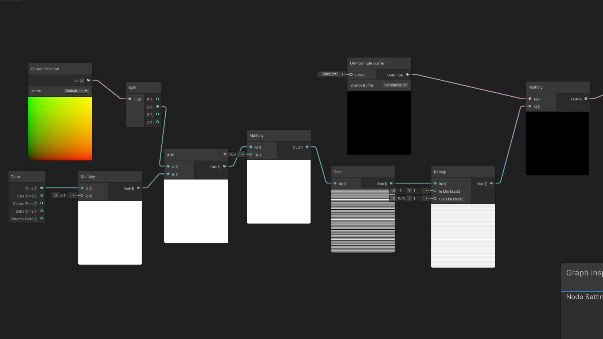
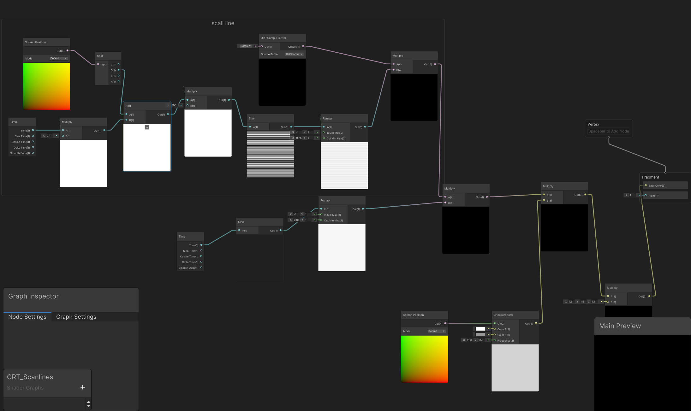
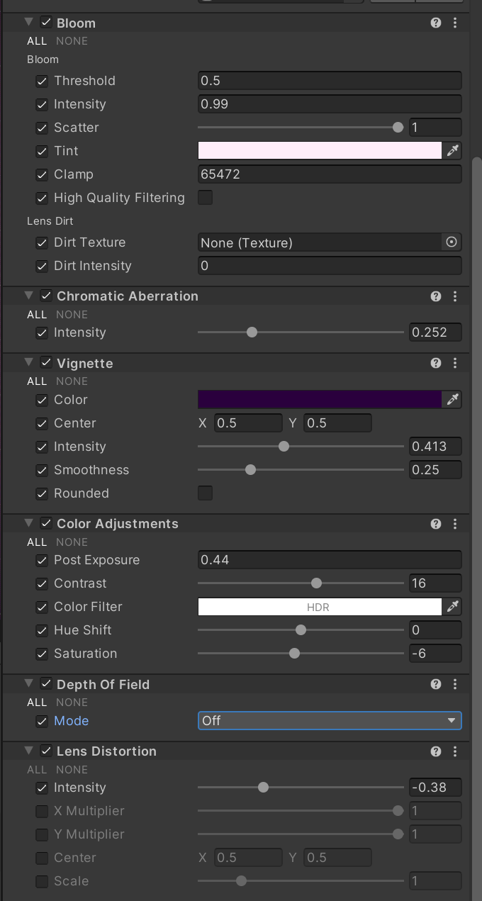

# 什么是CRT

   CRT效果（阴极射线管效果）是指模拟老式大头电视或显示器（CRT显示器，也就是大屁股电脑的显示器）显像风格的视觉特征，其特征是画面具有物理弧度，扫描线，RBG荧光光点，在有的老式CRT上还有会在电压不稳定导致的全局明暗微微闪烁，这些效果听起来像是把你的画面“变差”了，但是在有些情况下，会让你的画面多出别样的风味

我们先来看一组对比图，这是我制作的游戏咪西碰CRT的使用前后对比

* 使用CRT效果前

* 使用CRT效果后

注：这里我lens设置为负数，所以画面向里凹，而不是传统CRT的向外凸

  在我看来，这绝对是让画面变的更好了

  当然，使用CRT效果的独立游戏有很多，前两年爆火的《小丑牌》和《动物井》，你可以自行查看他们是如何使用CRT效果的

# 如何制作一个CRT效果

在开头已经提到了CRT的特征元素，接下来我们就一条一条的实现

### 开始之前

  请确保你的摄像机（main camera）开启了Post Processing，以便后续的后处理，再新建一个shader graph（Shader Graph->UPR->Full Screen Shader Graph），命名为CRT_Effect或者任意你喜欢的命名。请注意该shader类型为Full Screen Shader。右键该shader新建一个材质。

  点开左上角edit，侧边栏找到Graphics，点击在最顶上（或许版本不同会在其他敌方）Scriptable Render Pipeline Setting栏中的那个文件，再在那个文件的Rendering中点击Renderer  List中的文件（在我这里该文件命名为Renderer2D），点击最底下Add Renderer Feature，添加一个Full Screen Pass Rend，Injection Point改为后处理之前，在Pass Material中拖入我们刚刚新建好的材质，这样准备工作就完成了

### 正式开始

* #### 扫描线
  
  打开我们新建的shader graph文件，右键新建一个Screen Position节点，得到屏幕坐标，新建一个Split，将Screen Position的Out连接到Split的In上，这样我们就分离出了四个通道RGBA，在Shader Graph中数据是用向量（vector）表示的，屏幕坐标的R代表着X轴，G代表Y轴，因为我们要制作的是上下的扫描线所以我们后续将会使用G通道，新建一个Multiply（相乘）节点，将Split的G通道连入A，将Multiply的B设置为一个很大的值，我这里设置为了500，新建一个Sine（正弦）节点，将Multiply的Out连入In，这样你就得到了一堆密集的横线，为了看起来不那么死板，我们回到开头，新建一个Time节点，将Time连入一个新建的Multiply节点，将B设置为0.1（为了控制扫描线的速度，你可以自己手动调整数值达到不同效果），新建一个Add节点，断开开始的Split和原本的Multiply连线，将Split的Y和连接了Time节点的Multiply的Out分别连入Add的A与B，再将Add的输出连接到刚刚断开的那个节点上，我们就得到了会动的扫描线，新建一个Remap（重映射）节点，连入Sine节点的Out，将Remap节点的 Out Min Max（代表着重映射的结果）修改为0.75和1，你可以调整为不同数值可以达到不同效果，再新建一个UPR Sample Buffer节点（该节点作用为抓取处理前的游戏画面）和Multiply节点，将Remap节点的Out和UPR Sample Buffer节点分别连入Multiply节点，如果你没做错的话最终连线应该为图中这样

* #### 明暗变化
  
  因为变化和时间与周期有关，所以我们肯定会想到要新建一个Time节点，那有什么节点是能达到周期变化的呢？没错，就是再前文中也使用过的Sine节点，将Time连入Sine节点的In，这样就能得到周期性变化的黑白效果，由于我们要的是微微明暗变化所以我们再新建一个Remap节点，连入Sine的Out，将Out Min Max的值改为0.85和1，这样我们就能得到微微明暗变化的效果了，新建一个Multiply节点，将该Remap的节点的输出和我们在扫描线部分最后的Multiply节点分别连入新建的Multiply节点的A和B
  
  
  
  

* #### 像素荧光光点
  
   新建一个ScreenPosition节点和Checkerboard节点（棋盘格）将ScreenPosition的Out连入Checkerboard的UV，修改ColorA和ColorB可以更改棋盘颜色，建议改为白色和灰色，最下面的网格X,Y可以控制网格密度，建议给个300-500的值以模仿CRT的屏幕物理像素的颗粒感（晶格化），新建一个Multiply节点，将Checkerboard的输出和我们在明暗变化那一步最终的Multiply的输出分别连入新建的Multiply节点的A和B
  
  
  
  

* #### 提高亮度
  
  如果你直接将现在的Multiply的结果连入Fragment节点的base color就能看到crt基础效果了，但是你肯定会注意到屏幕比较暗，因为我们的扫描线，棋盘格，明暗变化都与屏幕输出相乘了（虽然不是同一个Multiply节点，但是从乘法的性质来说确实是相乘了），而这些值都小于1，自然导致了我们的屏幕变暗，所以在连入base color前我们先新建一个Multiply节点，将最终结果连入这个节点的A，在B输入一个大于1的值，我这边输入的是1.5，再将这个Multiply节点连入Fragment节点的base color
  
  如果你没连错的话节点应该是这样连的)
  
  
  
  
  
  

## 后处理

你先在应该已经能看到效果了，但是应该，呃…有点丑，那是因为我们还差了最后一步，后处理！

在你的场景新建应该空对象，命名为Global Volume，给他添加一个Volume脚本，再在Volume下Add Override，添加以下效果

* Bloom（泛光）

* Vignette（暗角）

* Chromatic Aberration（色差）

* Color Adjustment（色彩调整）

* Lens Distortion（镜头畸变）

以下是我的设置，你可以参考看看，并请你自己修改里面的值找到合适的效果

好了这片博客到此就结束了

你可以通过[Meeshy Pom! ](https://alqper.itch.io/mishy-pom) 下载游玩咪西碰，（也就是演示图片的游戏）

或者通过[[度盘](https://pan.baidu.com/s/1e1zZKnNPnDjcsRQpCCNKSg?pwd=eti2)  提取码: eti2 [M盘](https://mega.nz/file/mR1k2QBT#DsjpdGhAQIJrjbO9vU1xOQ7Y5Y7eQLINhM7nJWLuU3Y) 下载

下次再见！
